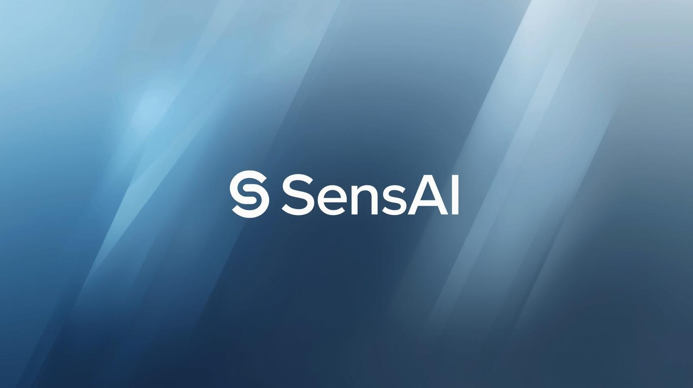

# 🤖 SensAI – AI Career Coach with Real-Time Insights & Mock Interviews




*Your AI-powered personal career mentor – Resume Builder, Mock Interviews & Market Insights*

---

## 📌 Overview

**SensAI** is a full-stack AI-powered career coach designed to assist students and professionals in their job preparation journey.  
It provides **personalized resume building, AI-driven cover letters, real-time job market insights, and intelligent mock interviews** to help users prepare effectively and stay industry-ready.

---

## ✨ Features

- 📄 **AI Resume & Cover Letter Builder** – Generate professional resumes & tailored cover letters.
- 🎤 **AI-Powered Mock Interviews** – Practice with instant feedback on answers, tone, and confidence.
- 📊 **Real-Time Market Insights** – Stay updated with trending job skills and market demand.
- 💡 **Personalized Career Guidance** – AI-driven suggestions for career path improvement.
- 🌐 **Full-Stack Web App** – Smooth & interactive user experience with modern UI.

---

## 🛠️ Tech Stack

- **Frontend**: Next.js 15, React 19, Tailwind CSS, Shadcn UI  
- **Backend**: Node.js, Flask (AI APIs)  
- **Database**: NeonDB (PostgreSQL) + Prisma ORM  
- **Authentication**: Clerk Auth  
- **AI/ML Models**: Google Gemini API, NLP models for feedback  
- **Others**: Inngest (automation & scheduling), REST APIs

---

## ⚙️ Methodology

1. **Resume Builder & Cover Letter Generator** – Uses AI to parse input data & create professional documents.  
2. **Mock Interview Module** – Provides real-time question-answer sessions with AI-driven analysis.  
3. **Job Insights Engine** – Fetches & analyzes live job data to recommend in-demand skills.  
4. **User Dashboard** – Tracks progress, feedback, and recommendations.  

---

## 🚀 Installation & Setup

1. Clone the repository  
   ```bash
   git clone https://github.com/your-username/sensai-career-coach.git
   cd sensai-career-coach
   ```

2. Install dependencies
   
    ```bash
    npm install   # frontend
    pip install -r requirements.txt   # backend

    ```
3. Setup environment Variables

   - DATABASE_URL – NeonDB connection string

   - NEXT_PUBLIC_CLERK_FRONTEND_API – Clerk authentication

   - GEMINI_API_KEY – Google Gemini AI API
     
 4.  Run the project
    ``bash
      npm run dev   # start frontend
      python api/main.py   # start backend
    ```

---
### 📊 Results & Output

   - ✅ Automatically generated professional resumes & cover letters

   - ✅ AI feedback on mock interviews (confidence score, improvement tips)

   - ✅ Skill gap analysis based on market demand

   - ✅ Interactive career dashboard

---
### 🤝 Contribution
- We welcome contributions! Here’s how you can help:

   - 🍴 Fork the repo

   - 🌱 Create a new branch (feature/new-module)

   - 💡 Make your changes

   - 📩 Submit a pull request

---
### 📚 References
- Frameworks/Libraries: Next.js, Tailwind CSS, Flask, Prisma, Clerk, Inngest

- APIs/Models: Google Gemini API, NLP toolkits

- Datasets: Public job market datasets (LinkedIn, Kaggle, Indeed)

- Research: AI in Career Coaching, Interview Feedback Models
---
### 👩‍💻 Team
- Aditi Yadav – Project Lead, Full Stack Developer

- Aditi Chourasiya – Frontend Developer

- Anshi Goyal – AI/ML Engineer

- Abhishek Chauhan – Backend Developer

Guided by Monika Choudhary
---
### 📜 License

This project is licensed under the MIT License – see the LICENSE file for details.

---
### ⭐ Support
If you like this project, don’t forget to star ⭐ the repo and share it with others!

<p align="center"> Made with ❤️ by the SensAI Team </p> ```
